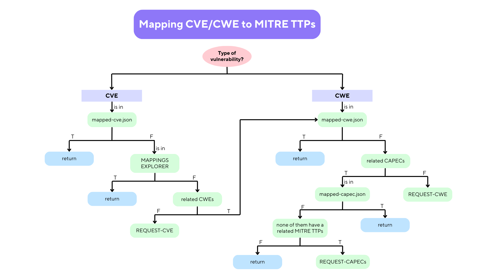

# DetectiveAttacks

## Functionality of Tool
**DetectiveAttacks** aims to simplify the process of mitigating cyber attacks directed toward digital infrastructure through the use of tools to:
- display all the information coming from the CTI community, through a single access point, single interface and showing all the relationships between them;
- offer the result of combining the `MITRE ATT&CK` and `MITRE ATLAS` matrices rearranged according to the `Cyber Kill Chain`;
- `classify vulnerabilities (CVEs and CWEs)` according to known `MITRE TTPs` and report on them in the frameworks used, either by `manual search` or by inclusion of a `CTI report` providing them;
- study the `consequent techniques that may have been employed or may manifest in the future on the chronological succession of CKC`, so as to ensure and prevent security in one's organization;
- provide the necessary reporting to conduct a more in-depth `analysis of the risk associated with the various known threat groups and agents`, based on the previously identified TTPs.\
 \
The software architetture is the following:


## GPT use
To get the relationship between CVE/CWE to MITRE TTPs i use this algorithm:




I use GPT4o deploy by azure, if you are student probably with your institutional email you have 100$ free in you azure account. So you cane deploy a model and do as mentioned below.

But to perform the query that I developed, you need to request the quota increse for you model, becouse the standar 1k token limit is too small, you must use at least 20k token limit per minute.

So if you would to use GPT, as i do, when the relationship is not available you need to create `.env` file in project root directory and put in it this params:
```bash
AZURE_OPENAI_API_KEY=<your-key>
AZURE_OPENAI_ENDPOINT=<your-endpoint>
AZURE_OPENAI_MODEL_ID=<your-deployed-model-name>
```

## Install
To install **DetectiveAttacks** you must have [docker](https://docs.docker.com/get-docker/) and [docker compose](https://docs.docker.com/get-docker/) (now it's included with docker).

After execute the following commands to download source code:
```bash
git clone --recursive https://github.com/nicolabalzano/DetectiveAttacks.git
```
or
```bash
git clone https://github.com/nicolabalzano/DetectiveAttacks.git
git submodule init
git submodule update
```

After all, you need to create the `.env` file as said in previous paragraph and leave the params empty if you not have GPT API (DetectiveAttacks will work anyway).

So start docker and type:
```bash
cd DetectiveAttacks
docker compose up
```

## Usage
To use DetectiveAttacks from its interface, go to `http://127.0.0.1:8080`, if you run in your local machine, otherwise `<machine-ip>:8080`. 

### API
---

If you want use the API of included package you can use these links:
```bash
# To obtain info about MITRE TTPs use 
127.0.0.1:8080/api/stix_and_vulnearbility/

# To use the cvwelib
127.0.0.1:8080/api/cvwelib/

# To use the capeclib
127.0.0.1:8080/api/capeclib
```

### capeclib
To know more about API of capeclib, check the offical repo [capeclib](https://github.com/nicolabalzano/capeclib.git).

### cvwelib
To know more about API of cvwelib, check the forked repo [cvwelib forked](https://github.com/nicolabalzano/cvwelib.git), by official [cvwelib](https://github.com/colelli/cvwelib.git).

### stix&vulnerabilty
The API avilable from this container are:

```bash
# To get CVEs, CWEs, CAMPAIGNS, TOOL, MALWARE, COURSE OF ACTIONS, INTRUSION SETS, ATTACK PATTERNS and ASSETS from search terms, type of objects (Attack, Campaign, Tool, Malware, Asset, Group, Mapped Vulnerability) and domain of reasearch (ATLAS, Enterprise, Mobile, ICS)
127.0.0.1:8080/api/stix_and_vulnearbility/get_data?search=?alltypes=?alldomains=all

# To get info about attack pattern by its MITRE ID
127.0.0.1:8080/api/stix_and_vulnearbility/get_data/get_attack_patterns?id=<MITRE-ID>

# To get info about campaign by its MITRE ID
127.0.0.1:8080/api/stix_and_vulnearbility/get_data/get_campaign?id=<MITRE-ID>

# To get info about tool or malware by its MITRE ID
127.0.0.1:8080/api/stix_and_vulnearbility/get_data/get_tool_malware?id=<MITRE-ID>

# To get info about asset by its MITRE ID
127.0.0.1:8080/api/stix_and_vulnearbility/get_data/get_asset?id=<MITRE-ID>

# To get info about intrusion set by its MITRE ID
127.0.0.1:8080/api/stix_and_vulnearbility/get_data/get_intrusion_set?id=<MITRE-ID>

# To get info about vulnearbility by its CVE/CWE ID
127.0.0.1:8080/api/stix_and_vulnearbility/get_data/get_vulnerability?id=<CVE/CWE-ID>

# To get all ATT&CK and ATLAS techniques grouped by phases of Cyber Kill Chain
127.0.0.1:8080/api/stix_and_vulnearbility/get_data/get_attack_patterns_grouped_by_CKCP

# To get CVEs and its assets to an CVE
127.0.0.1:8080/api/stix_and_vulnearbility/get_data/get_related_cves_and_assets_of_cve?id=<CVE-ID>
```
> [!TIP]
> There are also other API to get other unimportant info, but usefull to create interface, check the `/stix&vulnearbility/stix&vulnerability.py` file to see them.

> [!NOTE] 
> If you need more info or some other methods from one library contact me or open an issue, I will be happy to help you.

Enjoy it :) !


